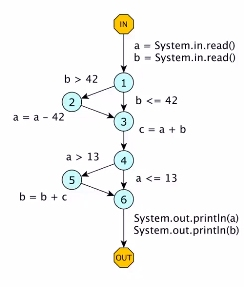

# 1. Тестирование ПО: основы

Тестирование --- это один из способов обеспечения качества ПО, в котором
пытаются обеспечить [функциональные](https://github.com/maratdin7/BoSE-answers#функциональные-требования) и [нефункциональные](https://github.com/maratdin7/BoSE-answers#нефункциональные-требования) требования.

* Функциональные требования --- делает ли ПО, что от него хотят
* Нефункциональные требования --- работает ли ПО, как должно (эффективно, надежно)

Есть ли какой-то универсальный способ проверить, что наш софт работает правильно?

* Запустить программу (Запуском можно проверить большинство Функциональных и Нефункциональных требований)
* Посмотреть на код (Это слишком сложно. У нас может быть разное окружение, разные библиотеки, нужно точно знать как работает стандартная библиотека => **Статический анализ это сложно!**)

Поэтому **тестирование** --- это один из методов обеспечения качества ПО, который запускает программу и проверяет, отвечает ли эта программа каким-то требованиям.

Тестирование отвечает на вопрос: 
> Работает ли ПО неправильно?

Потому что гарантировать, что-то другое мы не можем ~~Кроме формальной верификации, но это уже другая история~~

Фундоментальная проблема тестирования:

**Невозможно гарантировать, что для данного софта, не найдется ситуации, что что-то будет работать не так как нужно**

У тестирования есть два старших брата:
* Верификация – «мы сделали это правильно»
* Валидация – «мы сделали то, что надо»

В силу того, что тестирование ограничено каким-то набором запусков, то мы никогда не можем гарантировать, что приложение не упадёт и прочее.

Тестированием нужно заниматься как можно раньше, так как цена ошибки с каждой стадией проекта становится всё дороже (выпустив релиз с багом придётся его фиксить так, чтобы ничего не развалилось у конечных пользователей при обновлении)

# 2. Модель программной ошибки. Модель тестирования ПО и место тестирования в процессе разработки ПО.
Тестирование с точки зрения дилетанта:

> Запустили приложение и проверили результаты выполнения на предмет наличия в них ошибок

## Модель программной ошибки

1. **Ошибка(Error)** –-- ошибка в самой программе, внесенная на этапе разработки (что-то
написано в исходном коде так, что может привести к тому, что программа будет вести себя не так, как нужно)

1. **Сбой(Fault)** –-- некорректное состояние программы из-за ошибки (задедлочилась программа, что-то неправильно посчиталось)

1. **Неудача(Failure)** –-- наблюдаемое **снаружи** некорректное поведение программы (упала, зависла)

**Важная мысль тестирования:** большая часть того, чем занимается тестирование, это попытка сделать так, чтобы максимальное количество ошибок, разбросанные по программе, были залевелаплены аж до видимой снаружи неудачи.

## Модель тестирования ПО

```
Программная обеспечение
        |
       <?> — Результаты тестирования
        |
Эталонная модель
```

**Эталонная модель** может быть представлена множеством различных способов:
* Набор тестовых примеров
* Корректные результаты работы программы
* Формальная техническая спецификация
* Другая реализация

Почему тест может не пройти из-за:
* Проблема в ПО
* Проблема в тестовом окружении (Другие компоненты от которых зависит тестируемый компонент)
* Проблема в программно-аппаратная платформа 
* Проблема в Эталонной модели
* Проблема в оракуле

## Проблемы тестирования

1. Проблема тестовых входных данных
1. Проблема наблюдаемости (Не всегда можно просто изменяя входные данные добраться до *Неудачи*)
1. Проблема останова (Когда заканчивать тестирование)
1. Проблема тестового оракула

## Тестирование в процессе разработки ПО

### Модели разработки ПО

В большинстве подходов к разработке тестирование занимает большую чать работы 

1. Водопадная модель
    
    Тестирование выполняется над всей программой сразу, поэтому это немного упрощает задачу

    **Плюсы** 
    * В момент тестирования у нас есть всё, то есть вся программа уже реализована
    * Имеется хорошая эталонная модель (Так как есть хорошая документация и тех задание)

    **Минусы**    
    * Стоимость поиска и исправления ошибок очень высока
    
1. Инкрементальная модель

    Разработка проходит в несколько итераций

    **Плюсы**
    * Имеется не плохая эталонная модель
    
    **Минусы**
    * Стоимость поиска и исправления ошибок достаточно высока

1. Agile-подходы

    Все этапы разработки неразрывно связаны друг с другом

    **Плюсы**
    * Стоимость поискаи и исправления ошибок низкая

    **Минусы**
    * Эталонная модель есть не всегда (почти всегда нужны заглушки, так как нет еще какого-то модуля)
    * Если в процессе тестирования, что-то построено не совсем правильно, то это может достаточно сильно повлиять на то, что дальше всё может немного заработать неправильно
        * Тесты вообще не запускаются или работают не правильно
        * Ошибка в эталонной модели или при запуске тестов и мы думаем, что все плохо.

# 3. Проблема тестовых входных данных

[В пдф кобыжева стр. 5](./Расписанные_билеты_Тестирование_ПО.pdf#page=5)

# 4. Проблема неявных входных данных

[В пдф кобыжева стр. 7](./Расписанные_билеты_Тестирование_ПО.pdf#page=5)

# 5. Разработка через тестирование

[В пдф кобыжева стр. 8](./Расписанные_билеты_Тестирование_ПО.pdf#page=8)

Самый большой минус:

* При внесении изменений в интерфейсы компонентов системы необходимо изменить все тесты. Это может быть очеь дорого

* Невозможность тестирования сложного взаимодействия нескольких компонентов

# 6. Интеграционное тестирование

Интеграционное тестирование --- тестирует два или более модулей вместе

## Проблема большого взрыва

Когда-нибудь мы захотим заменить заглушку на реализацию, и в больших системах реализация может отличаться поведением от заглушки(и чаще всего так и будет). 

И после замены проблема может проявляться не напрямую, а **распространяться каскадно**. Такую ошибку **тяжело локализовать**, а **стоимость исправления** может быть большой, так как замена может происходить, когда уже написан ряд компонентов с упором на заглушку. 

Из-за замены большого числа заглушек на реализацию возникает **Проблема большого взрыва**

## Как бороться

* Протестировать заглушку относительно реализации
* Заглушку пишет разработчик, который реализовывал функциональность
* *Ускорить процесс замены заглушек на реализацию*

Замена заглушек на реализацию инкрементально --- **Инкрементальное интеграционное тестирование**

## Нисходящее интеграционное тестироване

* Тестирование начинается с верхних уровней системы (ядро системы, основные модули)
* Отсутствующие на данный момент модули заменяются “заглушками”
* По мере реализации новых модулей они подключаются к системе вместо “заглушек”

**Плюсы**
1. Возможность ранней проверки корректности ядра системы
1. Модули могут добавляться по одному, независимо друг от друга
1. Не требуется разработка множества драйверов (заглушка специального типа, которая находится сверху и умеет что-то делать с модулями, которые находятся ниже драйвера)
1. Можно разрабатывать систему как в глубину, так и в ширину

**Минусы**
1. Поздняя проверка перефирии (высокоуровнего поведения --- не ядра системы)
1. Требуется разрботка "заглушек"
1. **Крайне сложно корректно сформулировать требования ко входам/выходам частичной системы** 

    ```
            1
            /\
           2  3
          /
         4 
    ```
    Чтобы понять что должно быть на выходе у 1 если у нас есть 4,2,3 может быть не тривиально из спецификации

## Восходящее интеграционное тестирование

Тестирование начинается с нижних уровней (не ядра), так как там всегда есть хорошая спецификация, что должно быть на входе и на выходе (решаем проблему 3. из Нисходящего интеграционного тестирования) 

Отсутствующие на данный момент модули заменяются драйверами (Особого вида заглушка, которая умеет взаимодействовать или имитировать взаимодействие с ядром системы)

**Плюсы**
1. Возможность ранней проверки корректности низкоуровневого поведения (не ядра)
1. Не требует написания заглушек, но требуется писать драйвера
1. Просто определить требования ко входам/выходам (3. проблема нисходящего интеграционного тестироване)

**Минусы**
1. Отложенная проверка высокоуровневого поведения (ядра)
1. Требуется разработка драйверов
1. При замене драйвера на модуль высокого уровня может произойти “мини-Большой Взрыв”

**На практике используется комбинация нисходящего и восходящего интеграционного тестирования**

# 7. Проблема наблюдаемости. Ассерты.

## Проблема наблюдаемости

На практике тяжело изменяя входные данные превратить *сбой* с *неудачу*.

Поэтому нужно использовать второй способ управления выполнением кода --- **изменение исходного кода**

## Ассерты (Assert)

Assertion:
* Формула в логике первого порядка (более сложные логики на ЯП не пишутся)
* Проверяется на истинность во время выполнения программы.

Assertions позволяют проверить корректность внутреннего состояния:
* Внутреннее состояние обычно должно быть недоступно снаружи (из-за инкапсуляции)
* При изменении состояния хочется проверить, что оно остается корректным

Неудача происходит ближе к причине ее возникновения:
* Чем больше задержка перед обнаружением неудачи, тем сложнее найти ее исходную причину, Assertions позволяют найти неудачу практически в любой точке программы

Явное документирование пред- и постусловий:
* Позволяет проверить, что состояние программы до или после ф-ции находится в корректном состоянии

## Проблемы Assertions

1. Ошибки в ассертах. 
    * Могут изменять внутреннее состояние, тогда при их включении или отключении программа будет вести себя по-разному.
    * Просто неправильное условие (будем лишний раз падать)
1. Влияние на производительность
1. Эффект "вышибалы"
    * Сработавший ассерт превращает ошибку сразу в неудачу. И пока мы не поправим этот баг, продолжать тестирование нельзя, даже если это что-то незначительное
1. Сложность проверки определенных условий
    * Некоторые условия сложно проверить в ассерте

# 8. Проблема наблюдаемости. Журналирование.

Как вести журнал?

1. Ручная вставка журналирующих вызовов (вплоть до println)
    * Если мы хотим вести в каком-то смысле системный журнал вручную, то количество ручным способом вызванных логов увеличивается, и более того его ещё нужно поддерживать
1. Журналирующие аспекты/интерсепторы (что-то записывают во время работы)
1. Logging as a Service (запись логов в какой-то сервис, а не в файл)

[В пдф кобыжева стр. 13](./Расписанные_билеты_Тестирование_ПО.pdf#page=13)

# 9. Полнота тестирования ПО. Тестовое покрытие.

## Проблема останова

> По заданому алгоритму и входным данным определить, завершиься ли за конечное время его выполение

## Проблема останова в тестировании

За какое количество шагов мы протестировали программу нормально?

Чаще всего **тестирование бесконечный процесс**, потому что у нас нет механизма обратной связи когда программа протестирована хорошо.

Чаще всего нельзя себе позволить тестировать ПО бесконечное время (Дорого, долго)

**Проблема останова в тестировании:**

> По заданному набору тестов и программе определить, протетстировали ли мы ее достаточно хорошо

## Когда мы потестировали программу хорошо

**Когда нашли большую часть ошибок в программе**

Чтобы найти ошибку нужно как минимум ее "потрогать", а значит исполнить код.

*А значит если мы можем посмотреть, где мы побывали(**померять тестовое покрытие**), а значит понять насколько хорошо мы потестировали программу*

Из-за того что нет способа понять сколько мы ошибок нашли в программе, а сколько оставили, то **тестовое покрытие имеет смысл в динамике**

## Тестовое покрытие

Выделяют два основных вида покрытия
1. Покрытие потока управления (CFG)
1. Покртие потока данных (DFG)

### Покрытие потока управления

CFG --- представляет набор линейных последовательностей инструкций, ака базовые блоки(блоки кода), из которых состоит программа, связанных переходами по каким-то условиям

Покрытие потока управления может быть **по узлам**, **по дугам**, **по условия**, **по путям**

1. **Покрытие операторов программы (По узлам)**
    
    Интересует, что каждый кусочек программы был выполнен
    ```
         1
        /|
       2 |
        \|
         3
    ```
    Достаточно покрыть 1, 2, 3 (1, 3 покрывать не нужно так как побывали во всех ветвях) 

1. **Покрытие ветвелений программы (По дугам)**

    Интересует, что побывали в каждой ветке хотя бы один раз. 

    Почему покрытие ветвлений не включает в себя покрытие операторов?
    * В программе может быть мертвый код 
    * В программе могут отсутствовать ветвления

    ```
         1
        /|
       2 |  4
        \|
         3
    ```

     Достаточно покрыть 1, 2 и 1, 3 (4 покрывать не нужно) 

1. **Покрытие условй программы (По условиям)**

    Условие разделяется на подвыражения и требуется, чтобы каждое из них хотя бы раз приняло `true` или `false` 

    `if (req.isSsl() && (cfg.SsslEnabled() || cfg.isDebug()))` --- можно обеспечить покрытие условий, но не обеспечить покрытие ветвлений (`false`, `true`, `true` и `true`, `false`, `false`) 

1. **Покрытие ветвлений и условий программы**

    Комбинация соответствующих покрытий, Полностью их покрывает

    Но хочется еще показать, что каждое условие имеет возможность повлиять на исполнение программы

1. **Модифицированное покрытие ветвлений и условий MC/DC**

    Включает в себя **Покрытие ветвлений и условий программы**
    +
    Каждое подусловие должно влиять на поведение программы (каждое условие может повлиять на ветвления)

    Как это делается:
    * Подбираем такой тесткейс, который это обеспечивает почти руками
    * Полный перебор всех условий, но это слишком долго

1. **Покрытие путей программы (По путям)**

    Мы требуем, чтобы все возможные пути программы были выполнены хотя бы один раз

    * Обычно считается самым сильным типом покрытия потока управления
    * Данный тип покрытия можно было бы использовать, если бы не *циклы и рекурсия*
    * Для борьбы с этим используют несколько подходов, один из которых требует, чтобы тело цикла было выполнено: 0, 1, сколько-то посередине, максимальное число

### Покрытие потока данных

Чаще всего мы запускаем программу, чтобы она данные на входе преобразовала в данные на выходе.
Тогда для оценки покрытия лучше использовать информацию о том как программа обрабатывает данные.

Данные могут: Определяться или использоваться 
* **Определение переменной (Def):** 
    * Оператор программы, в котором значение переменной `v` может быть изменено
    * Определение переменной --- это те места в программе, где у данных в программе могут появиться новые значения

* **Использование переменной (Use):** 
    * Оператор программы, в котором значение переменной `v` влияет на выполнение программы
    * Использование переменное --- это места в программе, где значение может повлиять на то, что в программе происходит

**Def-Use Chain (d, u)** --- Цепочка от определения переменной до ее использования *(между d и u существует хотя бы один путь, на котором переменная v не переопределяется)*



1. **Покрытие всех определений:**

    Давайте проверим, что *каждое определение переменной* хоть раз где-то поиспользовалось
    Для данного случая нам достаточно входа, который пройдет так 1->2->3->4->5->6

1. **Покрытие всех использований:**

    Для каждой интересующей нас переменной `v` должна быть протестирована хотя бы одна Def-Use Chain от **каждого определения** `v` до **каждого использования** `v`

    1. 1->2->3->4->5->6
    1. 1->2->3->4->6
    1. 1->3->4->5->6

1. **Покрытие всех Def-Use Chain:**

    Для каждой интересующей нас переменной `v` должны быть протестированы все возможные Def-Use Chain от каждого определения `v` до каждого использования `v`

Почему не популярно?

1. Покрытие потока данных используется сильно реже, чем покрытие потока данных Def-Use Chain не отображаются простым способом в коде программы. В основном используется в нейронных сетях
1. *Покрытие потока управлениея хорошо ложится на текстовое представление кода*

# 10. Мутационное тестриование

Идея мутационного тестирования: У нас есть набор тестов, которые должны отличать нашу программу от не правильной программы. То есть если нашу программу поизменять(помутировать), то **тесты не должны проходить**

Если они не проходят, то говорят, что тест убил мутанта. Идея заключается в том, что чем больше мутантов убьют тесты тем они лучше

Какими могут быть мутанты: Добавить новый код, удалить старый код, изменить существующий код

После изменения кода получается следующий типы мутантов:
1. Синтаксически некорректные мутанты
1. Семантически некорректные мутанты (можно попробовать перевести в 3. вид)
1. Оставшиеся используются для мутационного тестирования

## Недостатки

1. Невозможно выполнить вручную
1. Тестирование требует больше ресурсов, так как нужно для каждого мутанта прогнать тесты, а еще мутантов нужно генерировать

Мутационное тестирование дает хорошую оценку качества тестов единомоментно

## Оценка тестового покрытия (Насколько хорошо тестовое покрытие проверяет качество тестов для нашей программы)

**Для Покрытие потока управления**

* Чувствительность к изменениям в исходном коде
    ```
    if (a && b && c) {}        bool = cond = a && b && c;
                               if (cond) {} 
    ```
    С точки зрения MC/DC условие справа имеет одно логическое условие, а слева – 3.

    Такое свойство называется нестабильность тестового покрытия.
    1. Чем сильнее влияют изменения в программе на тестовое покрытие, тем более нестабильным (fragile) является тестовое покрытие 
    1. Чем более нестабильным является тестовое покрытие, тем менее адекватно оно оценивает качество тестирования

Для того, чтобы с этим бороться можно использовать идею мутационного тестирования:
1. Ограничить набор мутаций, которые могут влиять на то, что покрытие поменялось 
1. Посмотреть на изменение тестового покрытия для мутантов (если сильно плавает, то покрытие неустойчиво)

**Проблема мутационного тестирования --- эквивалентные мутанты**

Эквивалентные мутанты --- разные экземпляры программы, но с точки зрения поведения программы одинаковые

Эквивалентные мутанты зашумляют итоговую оценку

Чтобы побороться с проблемой эквивалентных мутантов, можно
применить покрытие потока управления (у мутантов будет очень похожее покрытие)

# 11. Тестовые оракулы

**Тестовый оракул** --- это какой-то компонент, который делает итоговое суждение о том, что софт не соответствует эталонной модели. (шестиугольник с вопросиком на картинке ранее)

## Проблема тестового оракула --- его нет в общем случае

Вид тестового оракула очень сильно зависит от того, какую эталонную модель мы используем

Что мы хотим от тестового Оракула: 100% Точность и 100% полнота 

**Точный оракул** --- оракул который не срабатывает ложно. То есть он никогда не говорит, что что-то сработало не правильно когда оно сработало правильно (Пример не точного оракула это *flake-тесты*)

Ложные обнаружения при тестировании --- лишние затраты на их обнаружение и игнорирование

**Полнота** --- способность оракула находить все ошибки

## Виды оракулов

1. Слабые (100% точность, полнота низкая)
1. Средние (50% точноть, 50% полнота)
1. Сильные (100% точноть, 100% полнота)

### Слабые

**Слабые оракулы, которым все равно на эталонную модель** 

Какое-нибудь падение (Segmantation fault ...)

* **Работают всегда** --- если софт падает, то мы это найдем
* Практически не дают информацию об ошибке. (Но можно собирать трассу и логи)

1. Если мы исполняемся в какой-нибудь виртуальной машине, то у нас при падении есть исключение, которое дает нам информацию где что-то пошло не так

1. Но можно обычные бинарные файлы запускать в специальном окружении (Valgrind --- предоставляеют специальную среду выполнения)

У слабых оракулов Плохая полнота, потому что если то, что у нас пошло не так, никак не приводит к видимой неудаче снаружи в виде падения, то мы никогда об этом не узнаем

### Средние оракулы (Assertions, Тесты)

Требуют определенных усилий со стороны разработчиков

В зависимости от степени усилий, будут более или менее точно указывать на место возникновения ошибки и класс ошибки

**Хорошая точноть**

**Средняя полнота**, потому что это не даёт нам универсальной схемы, по которой мы можем **найти любое неправильно поведение программы**. Написать все возможные тесты и ассерты практически невозможно, поэтому полнота средняя.

### Сильные оракулы

* Эталонная релизация
* Обратная ф-ция

**Хорошая точность**

**Хорошая полнота**

## Генерация оракулов

Можно генерировать Слабые и Средние оракулы, потому что если мы можем сгенировать сильный оракул мы написали нашу программу

### Генерация слабых оракулов (не нужно генерировать)

* Слабый оракул всегда есть
* Софт есть 
* Если он упал это баг

Сложно понять где произошла ошибка 

### Генерация средних оракулов

#### Генерация ассертов
1. Вариат

    1. Собираем информацию о выполнении программы (какие значения принимают разные переменные в разных частях программы)
    1. Выводим определенные закономерности в работе программы (какие-то две переменные никогда не равны 0 и т. д.)
    1. Генерируем assertion, проверяющий не нарушение закономерностей

    **Проблемы**
    1. Обучились на неправильном состоянии, тем самым сгенерировав неправильный ассерт
    1. Не сгенерировали ассерт, который никогда не видели
    1. Сгенерировали слишком узкий ассерт, потому что видели мало состояний

    Если сгенерированный ассерт провалился, то мы можем уже вручную посмотреть и понять, почему он не сработал. Улучшить генератор или что-то такое

1. Вариант

    1. Собираем информацию о выполнении программы
    1. В случае падения определяем его причину (например, NullPointerException)
    1. Генерируем защитный assertion

    В итоге усиливаем слабые оракулы до средних, но не работает если нет падения

#### Генерация тестов

Генерация тестов при помощи мутационного тестирования
1. Если тест проходит на мутанте, это плохо
1. Собираем информацию о выполнении программы и мутанта
1. Анализируем разницу, и на основе этой разницы можно понять, как поменять тест, чтобы он начал проваливаться на изменённой программе

Проблема в том, что нужен уже достаточно большой набор тестов 

# 12. Случайное тестирование. Фаззинг.

[В пдф кобыжева стр. 23](./Расписанные_билеты_Тестирование_ПО.pdf#page=23)

# 13. Случайное тестирование. Генеративный и мутационный подходы.

[В пдф кобыжева стр. 24](./Расписанные_билеты_Тестирование_ПО.pdf#page=24)

# 14. Случайное тестирование. Направленное случайное тестирование и друзья.

[В пдф кобыжева стр. 25](./Расписанные_билеты_Тестирование_ПО.pdf#page=25)

# 15. Регрессионное тестирование. Выборочное регрессионное тестирование.

[В пдф кобыжева стр. 27](./Расписанные_билеты_Тестирование_ПО.pdf#page=27)

**Регрессии** --- ошибки появившиеся в результате маленьких инкрементальных измененний (иногда повторные ошибки)

Основной вид тестирования ПО --- тестироавини после внесения маленьких изменений --- это и буде **регрессионное тестирование**

# 16. Регрессионное тестирование. Другие проблемы.

[В пдф кобыжева стр. 29](./Расписанные_билеты_Тестирование_ПО.pdf#page=29)

# 17. Дебаггинг. Дельта дебаггинг.

[В пдф кобыжева стр. 31](./Расписанные_билеты_Тестирование_ПО.pdf#page=31)
